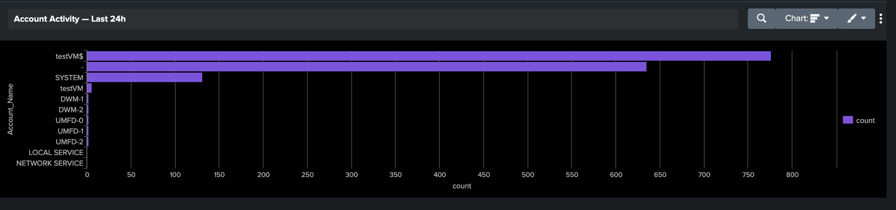
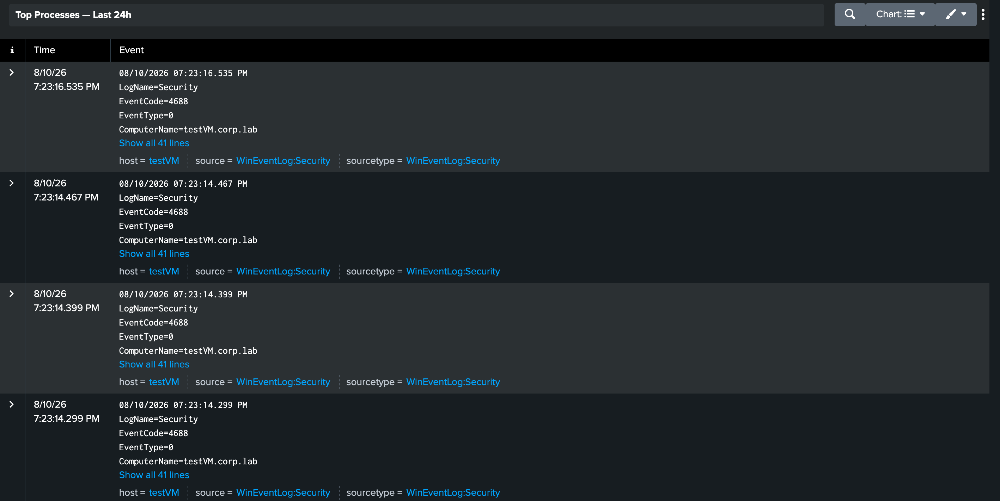
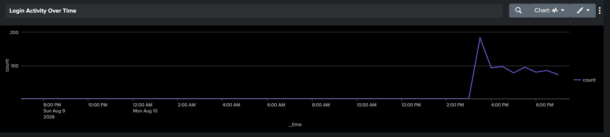
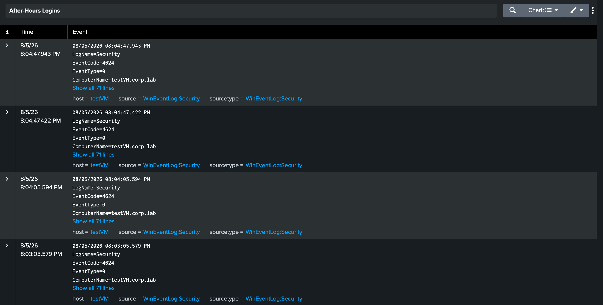

# Lab 3: Splunk SIEM & Log Analysis

**Splunk Enterprise (Free) · Azure · SOC / Security Monitoring**

🎥 **Video walkthrough:** [Watch the recap on Loom](https://www.loom.com/share/151ddeb00d834a0ca1c66151850eed07)

I built a working SIEM. I stood up Splunk on an Ubuntu VM in Azure, forwarded the Windows Security logs from my Active Directory domain controller (the `testVM.corp.lab` box from Lab 1) into it, then wrote SPL searches, built a security dashboard, and set up an automated alert. This is the exact workflow a SOC analyst lives in: get the logs in, search them, visualize them, and get notified when something looks wrong. Below is what I built, the searches I used, and what I took away.

This lab connects the whole series: Lab 1 built the environment, Lab 2 was network-level analysis, and Lab 3 is host/log-level monitoring of that same environment. It also maps directly to cloud SIEM tooling: Microsoft Sentinel and AWS Security Hub use the same concepts I used here.

---

## What a SIEM is for

A real organization generates millions of log events a day across servers, workstations, firewalls, and cloud services. Without a SIEM, those logs sit in separate systems and nobody can search across them or correlate events. A **SIEM** (Security Information and Event Management) pulls all of it into one searchable place. Its two core jobs are **correlation** (connecting events across systems to reveal patterns no single system would show) and **alerting** (automatically flagging suspicious conditions). When an alert fires, the analyst opens the SIEM and searches the logs to answer: what happened, when, from where, and what was affected.

Applies to: SOC Analyst (Tier 1-3) · Security Engineer · Incident Responder · Cloud Security Engineer

---

## Architecture

The data flow is simple and it's the same pattern used in production:

```
Windows Server VM (testVM.corp.lab, my Lab 1 domain controller)
        │
        │  Universal Forwarder  →  port 9997
        ▼
Ubuntu VM running Splunk Enterprise  →  indexes logs  →  Splunk web UI (port 8000)
```

My Windows domain controller runs a lightweight **Universal Forwarder** that ships its Windows Event Logs to a separate Ubuntu VM running Splunk. Splunk indexes those logs into an index I created called `windows_logs` and makes them searchable in the web UI.

---

## What I built

### 1. Deployed Splunk on an Ubuntu Azure VM
Created an Ubuntu 22.04 VM (Standard_B2s, 4GB RAM since Splunk needs it), with NSG inbound rules scoped tightly:
- **8000** (Splunk web UI) and **22** (SSH) open to **my IP only**
- **9997** (forwarder input) open to the **VNet range only**, so only my other Azure VMs can send logs, not the public internet

### 2. Connected over SSH and installed Splunk
SSH'd in from my Mac. First real gotcha: the Azure `.pem` key downloads with permissions that are too open, and SSH refuses to use it until you lock it down.

```bash
chmod 400 yourkey.pem
ssh -i yourkey.pem azureuser@<VM_PUBLIC_IP>
```

Then downloaded and installed Splunk, started it, and set it to launch on boot so I never have to start it manually again:

```bash
wget -O splunk.deb "https://download.splunk.com/products/splunk/releases/10.2.2/linux/splunk-10.2.2-80b90d638de6-linux-amd64.deb"
sudo dpkg -i splunk.deb
sudo /opt/splunk/bin/splunk start --accept-license --run-as-root
sudo /opt/splunk/bin/splunk enable boot-start
```

Accessed the web UI at `http://<VM_PUBLIC_IP>:8000`.

### 3. Enabled receiving and created an index
In the Splunk UI:
- **Settings → Forwarding and Receiving → Configure Receiving → New** → port **9997**
- **Settings → Indexes → New Index** → named it **`windows_logs`**

An index in Splunk is like a database table: a named storage bucket for events. Keeping Windows logs in their own index lets me control retention and permissions separately from other data sources.

### 4. Installed the Universal Forwarder on the Windows domain controller
On the Lab 1 Windows Server VM, installed the Universal Forwarder and pointed it at the Splunk VM's **private IP** on port **9997**. Key detail I got right: leave the **Deployment Server blank** during install. Setting it to your own Splunk IP makes the forwarder phone home to the wrong place and no data flows.

### 5. Configured inputs.conf to choose what to forward
The forwarder only sends what you tell it to. I created `inputs.conf` to collect the Windows Security, System, and Application logs and route them to my `windows_logs` index:

```ini
# C:\Program Files\SplunkUniversalForwarder\etc\system\local\inputs.conf

[WinEventLog://Security]
disabled = 0
start_from = oldest
current_only = 0
evt_resolve_ad_obj = 1     # resolve AD names so usernames show instead of SIDs
index = windows_logs

[WinEventLog://System]
disabled = 0
index = windows_logs

[WinEventLog://Application]
disabled = 0
index = windows_logs
```

Then restarted the forwarder to apply it:

```powershell
Restart-Service SplunkForwarder
```

### 6. Generated test activity
Since it was a fresh VM with mostly empty logs, I ran a PowerShell script to generate realistic security events: failed logins, a successful login, service restarts, application warnings, and an account lockout. That gave Splunk real data to search: **4624** (successful logon), **4688** (process creation), **4740** (account lockout), and more.

---

## The Windows Event IDs that matter

These are the codes I searched on constantly, and they're the ones that matter most in security work:

| Event ID | What it means | Why it matters |
|---|---|---|
| 4624 | Successful logon | Who logged in, when, and how (interactive/remote/service) |
| 4625 | Failed logon | Repeated failures = possible brute force |
| 4688 | New process created | Core of threat hunting: what actually ran |
| 4672 | Privileged logon | Admin-level rights assigned at logon |
| 4740 | Account lockout | A trail of these can mean a password-spray attack |

---

## SPL searches I wrote

SPL (Splunk Processing Language) works as a pipeline: start with a search, then pipe the results through commands that filter, shape, and visualize.

**Confirm data is flowing:**
```spl
index=windows_logs | head 100
```

**Successful logins by account:**
```spl
index=windows_logs sourcetype=WinEventLog:Security EventCode=4624
| stats count by Account_Name
| sort -count
```

**Detect after-hours logins (the one that feels like real detection):**
```spl
index=windows_logs sourcetype=WinEventLog:Security EventCode=4624
| eval hour=strftime(_time, "%H")
| where hour < 7 OR hour > 19
| table _time, Account_Name, Account_Domain, ComputerName
| sort -_time
```
Account names ending in `$` are computer accounts, which is normal. A **human** account logging in after hours is what you'd actually investigate.

---

## The dashboard

I turned the searches into a dashboard called **Windows Security Overview** so I get a permanent at-a-glance view instead of running searches by hand every time. Four panels:

**Account Activity (Last 24h)** — logon count by account. `testVM$` (the machine account) and SYSTEM dominate, which is the normal baseline. Knowing what "normal" looks like is what lets you spot abnormal.



**Top Processes (Last 24h)** — process-creation events (EventCode 4688) from `testVM.corp.lab`. This is endpoint execution monitoring: seeing what ran, when, and under which account.



**Login Activity Over Time** — a `timechart` of logon volume. The spike to ~180 around 3 PM is exactly the kind of shape an analyst learns to notice in a timeline.



**After-Hours Logins** — successful logons (4624) filtered to outside business hours. This is a real detection use-case, not just a chart.



The SPL behind each panel:

```spl
# Account Activity
index=windows_logs sourcetype=WinEventLog:Security EventCode=4624 | stats count by Account_Name | sort -count

# Top Processes
index=windows_logs sourcetype=WinEventLog:Security EventCode=4688 | stats count by Creator_Process_Name | sort -count | head 20

# Login Activity Over Time
index=windows_logs sourcetype=WinEventLog:Security EventCode=4624 | timechart count

# After-Hours Logins
index=windows_logs sourcetype=WinEventLog:Security EventCode=4624 | eval hour=strftime(_time, "%H") | where hour < 7 OR hour > 19 | table _time, Account_Name, Account_Domain, ComputerName | sort -_time
```

---

## Automated alert

Dashboards need a human watching them. An alert doesn't. I built one that runs a search on a schedule and records a hit whenever the condition is met, which is how real SOC detection works.

```spl
index=windows_logs sourcetype=WinEventLog:Security EventCode=4672
| stats count as privilege_logons by Account_Name, ComputerName
| where privilege_logons > 50
```

Saved as an alert named **High Privileged Logon Count**, set to run every 15 minutes (`*/15 * * * *`), triggering when results are greater than 0, with the action set to **Add to Triggered Alerts** so every hit gets logged with a timestamp in Splunk's own alert history.

The real lesson here: alert quality is everything. Too broad and analysts get alert fatigue and stop looking. Too narrow and you miss real threats. The threshold is a starting point you tune based on how many false positives you actually see.

---

## Problems I hit and fixed

| What broke | Cause | Fix |
|---|---|---|
| `chmod`/SSH refused the key | Azure `.pem` downloads with permissions too open | `chmod 400 yourkey.pem` before connecting |
| Web UI "site can't be reached" on :8000 | Missing NSG rule for port 8000 | Added an inbound rule allowing 8000 from my IP |
| No logs arriving from the forwarder | Port 9997 blocked / VMs in different VNets | Added a 9997 NSG rule, and set up VNet peering so the two VMs could talk |
| Public IP changed between sessions | Azure reassigns dynamic IPs on stop/start | Set the public IP to **Static**, and always grab the current IP from the portal |
| Fresh VM had empty logs | Nothing had happened on it yet | Ran a script to generate real security events before searching |

---

## Key takeaways

1. **Getting data in is the whole first battle.** A SIEM is only as good as its inputs. Half this lab was forwarder config, NSG rules, and VNet peering, and that's true in the real world too.
2. **Know what normal looks like.** The dashboard is mostly machine accounts and SYSTEM. You can't spot the abnormal login until you know the baseline.
3. **SPL is the skill.** Dashboards are nice, but the analysts who actually find threats are the ones who can write the search. `stats`, `eval`, `where`, and `timechart` carried this entire lab.
4. **Alerts beat dashboards.** A dashboard needs someone looking at it. A scheduled alert watches for you, which is how detection actually scales.
5. **It's the same model in the cloud.** Everything here maps onto Microsoft Sentinel and AWS Security Hub. Splunk was just where I learned the mental model.

If I did this again, I'd put all my lab VMs in **one shared VNet** with a subnet per environment from the start. That single decision would have saved me the VNet-peering detour entirely, since VMs in the same VNet can talk without it.

---

## SPL quick reference

```spl
index=windows_logs | head 100                       # confirm data is flowing
... EventCode=4624 | stats count by Account_Name     # logins by account
... EventCode=4688 | stats count by Creator_Process_Name   # process execution
... EventCode=4740                                   # account lockouts
... | eval hour=strftime(_time,"%H") | where hour<7 OR hour>19   # after-hours filter
... | timechart count                                # volume over time
```

**Status: complete.** Splunk deployed → Universal Forwarder configured → logs flowing into `windows_logs` → SPL searches → security dashboard → automated alert.
